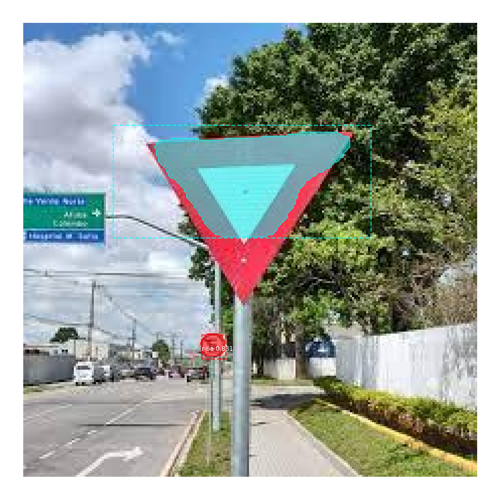
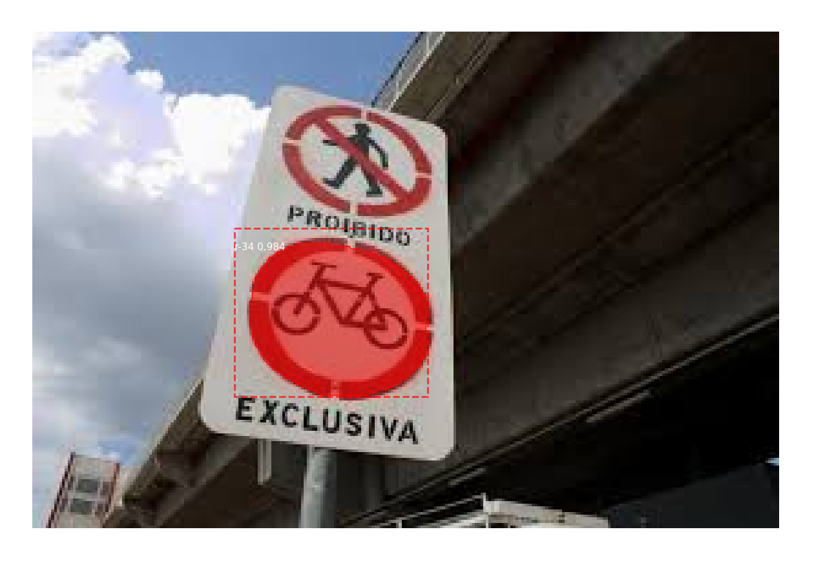
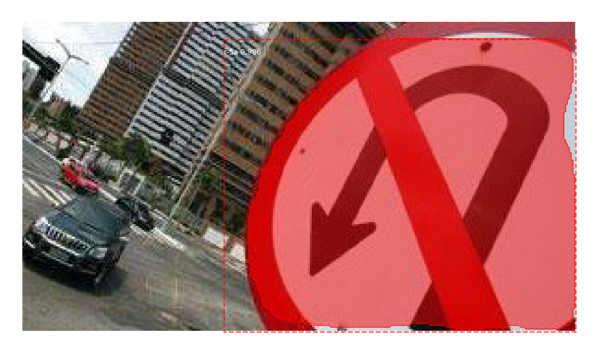
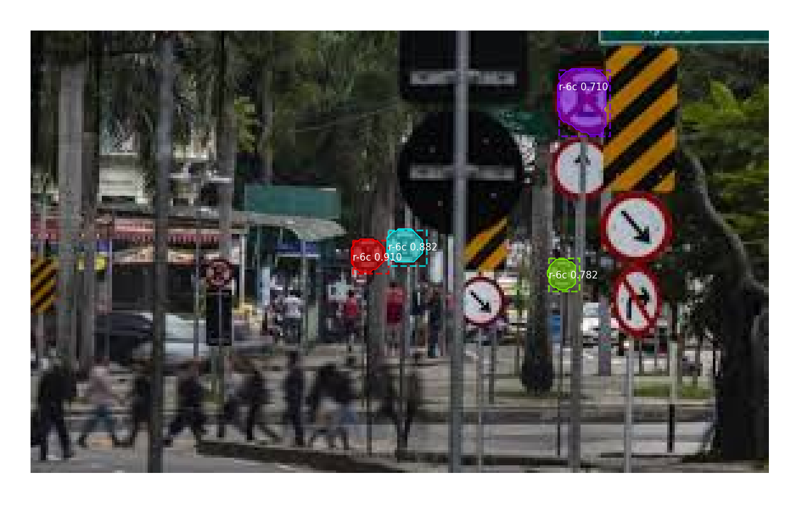
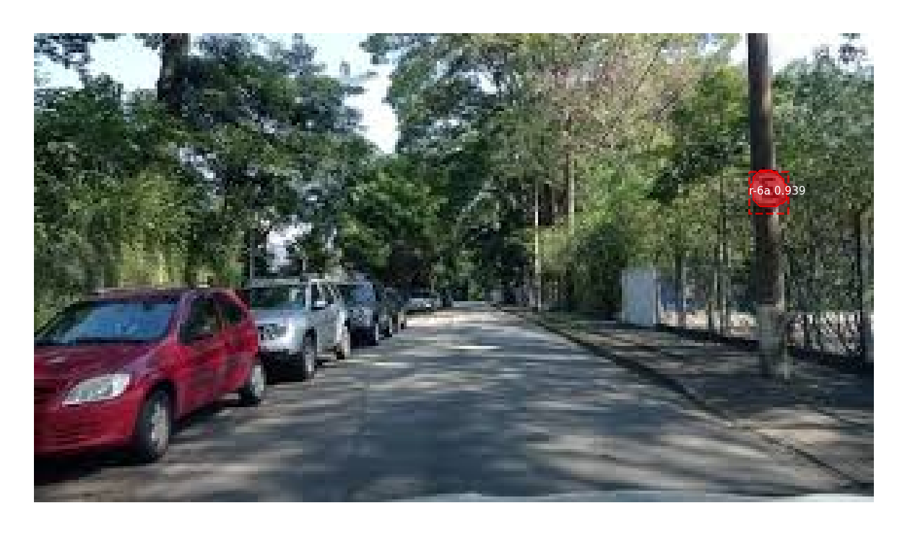
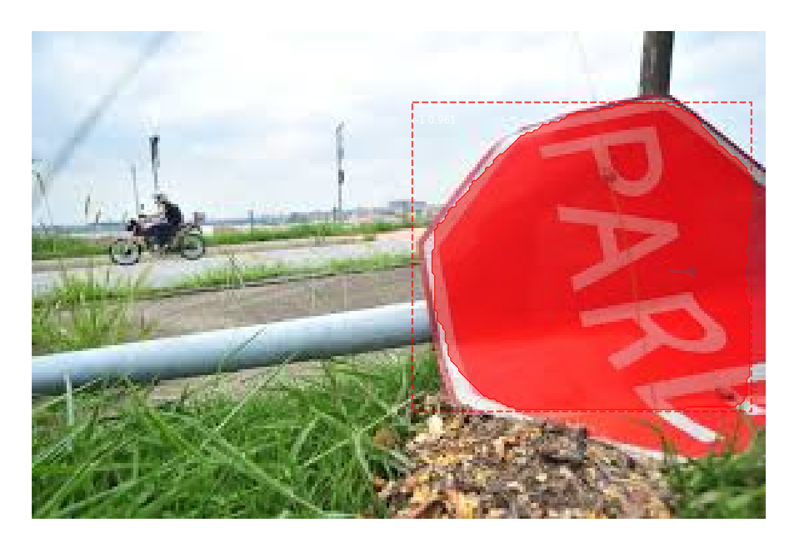
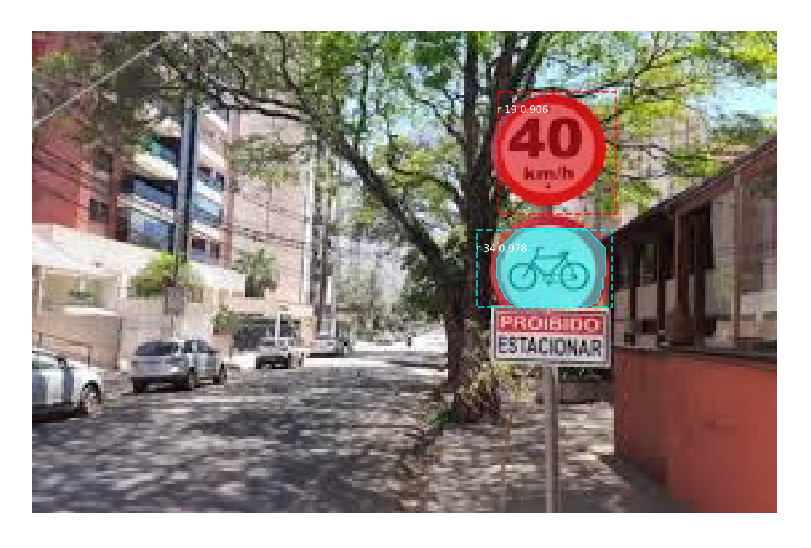
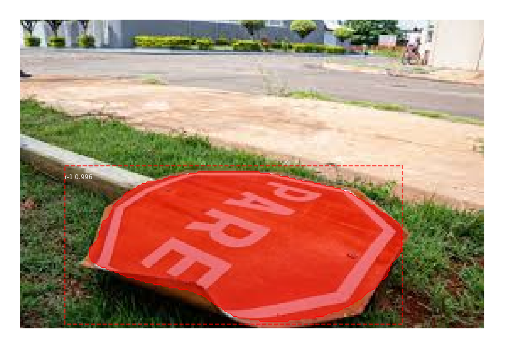

# Signal Plates Identifier

## Introdução
Este projeto é um modelo de inteligência artificial que utiliza de uma Rede Neural Convolucional Baseada em Regiões (RCNN). O objetivo deste modelo é identificar placas de trânsito do CONTRAN de fotografias através de visão computacional. 

Abaixo buscamos explicar como foi realizado o desenvolvimento deste modelo e também as dificuldades encontradas.

## Construção e Análise do Dados
### 1. Coleta de Dados
Dada a falta de imagens públicas de placas de trânsito em um banco de dados centralizado, decidimos obter os dados necessários através da técnica de _web scraping_.
  
Para isso criamos um [repositório separado](https://github.com/caribeedu/Google-Image-Scraper) onde implementamos um _web scraper_ em Python focado em obter imagens do Google Imagens, por ele conseguimos passar termos de busca específicos e as imagens de resultado são baixadas na máquina local automaticamente.

Usando o seguinte padrão para os termos de busca; `placa <nome-da-placa> rua`, conseguimos obter mais de **7000** imagens como resultado. Com isso, fazendo uma seleção manual, atingimos **mais de 500** fotografias reais de diferentes placas de trânsito do CONTRAN. Este _dataset_ já filtrado pode ser acessado [aqui](https://drive.google.com/file/d/1d1ni3fdETzC6S7itu7IwAhSsYAypCoBC/view?usp=drive_link).

### 2. Anotação dos Dados
Uma vez com um _dataset_ sólido, seguimos para a anotação das imagens. Para esta tarefa, utilizamos o [VGG Image Annotator](https://www.robots.ox.ac.uk/~vgg/software/via/via.html), uma aplicação web simples que permite a anotação necessária. 

Decidimos neste momento utilizar o tipo de máscaras de poligonal, tentando buscar posteriormente uma maior precisão no nosso modelo. Ao todo, foram aproximadamente **566** imagens revisadas, onde destas, apenas 19 não eram válidas e foram descartadas.

Caso tenha interesse, você pode explorar este _dataset_ localmente, basta [baixá-lo](https://drive.google.com/file/d/1d1ni3fdETzC6S7itu7IwAhSsYAypCoBC/view?usp=drive_link), abrir o arquivo `via.html` com qualquer navegador, clicar em "Project > Load Project" e em seguida selecionar o arquivo `signal-plates-identifier-vgg-project.json`. A partir disto, é possível visualizar as anotações existentes e também adicionar novas imagens/anotações.

### 3. Análise dos Dados
Agora com o _dataset_ devidamente anotado, fizemos uma breve análise exploratória para entender melhor a relação das imagens obtidas. Basicamente a distribuição final de placas foi a seguinte:

| Código da Placa | Quantidade de Ocorrências |
|------------|-------------|
| R-1        | 71          |
| R-2        | 13          |
| R-3        | 35          |
| R-4a       | 31          |
| R-4b       | 23          |
| R-5a       | 13          |
| R-5b       | 1           |
| R-6a       | 117         |
| R-6b       | 125         |
| R-6c       | 48          |
| R-7        | 8           |
| R-8a       | -           |
| R-8b       | 1           |
| R-9        | 29          |
| R-10       | 1           |
| R-11       | 3           |
| R-12       | 5           |
| R-13       | -           |
| R-14       | 1           |
| R-15       | 12          |
| R-16       | -           |
| R-17       | 1           |
| R-18       | -           |
| R-19       | 51          |
| R-20       | 5           |
| R-21       | -           |
| R-22       | -           |
| R-23       | -           |
| R-24a      | 11          |
| R-24b      | 9           |
| R-25a      | 3           |
| R-25b      | 8           |
| R-25c      | 9           |
| R-25d      | 3           |
| R-26       | 9           |
| R-27       | 5           |
| R-28       | 5           |
| R-29       | 5           |
| R-30       | -           |
| R-31       | -           |
| R-32       | 15          |
| R-33       | 9           |
| R-34       | 13          |
| R-35a      | 1           |
| R-35b      | 1           |
| R-36a      | 3           |
| R-36b      | 3           |
| R-37       | 3           |
| R-38       | -           |
| R-39       | 3           |
| R-40       | 1           |

Apesar da distribuição má balanceada, decidimos seguir com o _dataset_ da maneira apresentada acima para que pudéssemos validar quais resultados conseguiríamos alcançar.

### 4. Transformação dos Dados
Dado que neste ponto já tínhamos o _dataset_ pronto, era necessário distribuí-lo em dois _datasets_, de treino e de validação, antes de seguirmos com o desenvolvimento do modelo. 
Para esta tarefa utilizamos o _notebook_ [`transform_data`](https://github.com/caribeedu/signal-plates-identifier/blob/main/transform_data.ipynb), com ele pegamos uma imagem de cada placa para o _dataset_ de validação e o restante foi para o _dataset_ de treinamento.

O resultado final do _dataset_ transformado pode ser acessado [aqui](https://drive.google.com/file/d/1xjfm5-oBZgm-RAe2CaXg5tEV6CYYP3e_/view?usp=sharing). É este _dataset_ que iremos utilizar durante o treinamento.

Observação: É importante destacar que; para as placas que continham apenas uma ocorrência, destinamos as imagens das mesmas para o _dataset_ de treinamento, uma vez que não faria sentido usá-las no _dataset_ de validação.

## Desenvolvimento e Avaliação do Modelo

### 1. Decisão de Tecnologias
Primeiramente precisávamos escolher o tipo/arquitetura de rede neural a ser utilizada. Decidimos seguir com a arquitura R-CNN (que utiliza a arquitetura ResNet no _back-bone_) pois a habilidade de se extrair áreas de interesse baseadas em regiões é muito apropriada para o tipo de problema que queremos resolver, no caso, segmentação de instâncias de objeto.

O próximo passo seria escolher entre implementar do zero uma rede neural seguindo a arquitetura de R-CNN ou utilizar uma implementação já existente. Neste momento encontramos o artigo [Mask R-CNN](https://arxiv.org/abs/1703.06870), que descreve um framework para segmentação de instâncias de objetos. A partir dele, foi criado um projeto _open-source_ de mesmo nme que implementa a ideia descrita no artigo, o [Mask R-CNN](https://github.com/matterport/Mask_RCNN) do [matterport](https://github.com/matterport).

### 2. Desenvolvimento do Modelo

#### 2.1 Compatibilidade do framework
Uma vez com a arquitetura escolhida e o framework em mãos nos deparamos com uma questão. Este projeto tem a exigência de ser realizado com Python na versão `3.8` ou superior. O problema é que a implementação do [matterport](https://github.com/matterport) utiliza a versão 1 do Tensorflow, não compatível com o Python `3.x`. 
 
Para resolver isso buscamos versões alternativas desenvolvidas pela própria comunidade do [Mask R-CNN](https://github.com/matterport/Mask_RCNN), que adaptassem a implementação original para o Tensorflow `2.x`, o que consequentemente implicaria em aceitar o Python `3.x`. A implementação adaptada escolhida foi a [Mask R-CNN TF2.7](https://github.com/Kamlesh364/Mask-RCNN-TF2.7.0-keras2.7.0). E finalmente, após algumas correções a mais, tínhamos nosso framework pronto para uso.

#### 2.2 Treinamento

##### 2.2.1 Requisitos
Para executar o treinamento é necessário ter instalado em sua máquina as seguintes bibliotecas:

- CUDA Toolkit `v11.0.2`
- Tensorflow `v2.5.0`
- Keras `v2.5.0rc0`

##### 2.2.2 Ambiente
Agora com o framework funcionando adequadamente e com o _dataset_ devidamente tratado, podemos preparar o treinamento.
 
Por uma questão de desempenho do treinamento decidimos utilizar o [Google Colab](https://colab.google/), nos ambiententes de execução `T4 GPU/V100 GPU`. O _notebook_ utilizado para o treinamento está presente em [`/model/master.ipynb`](https://github.com/caribeedu/signal-plates-identifier/blob/main/model/master.ipynb). 

Caso tenha interesse, você pode executar o mesmo treinamento realizado durante este projeto, basta baixar o _notebook_ e importá-lo no Google Colab.

##### 2.2.3 Aprendizado por transferência
Na busca de tentar melhorar a precisão do nosso modelo, buscamos realizar a técnica de _transfer learning_, onde com ela poderíamos obter um conhecimento prévio de outro modelo pré-treinado e assim, extrair as _features_ desejadas com mais facilidade em nosso modelo. Para a realização desta técnica, utilizamos o modelo pré-treinado do [COCO](https://github.com/matterport/Mask_RCNN/releases/tag/v2.0).

##### 2.2.4 Execução
O _notebook_ por ser _self-contained_ já realiza; o download do _dataset_, configuração do ambiente e a instalação de dependências. Você também pode executá-lo no Jupyter, basta ignorar a seção de configuração do ambiente Colab (atenção aos requisitos citados acima).

### 3. Avaliação do Modelo

#### 3.1. Primeiro modelo
No nosso primeiro modelo obtivemos resultados bem insatifatórios, o que já era esperado, já que temos um _dataset_ desbalanceado além de termos usamos uma quantidade pequena de épocas (15) com apenas 150 passos. Além disso neste primeiro modelo havíamos treinado apenas as camadas superiores da rede neural, deixando as camadas de _back-bone_ intactas.

##### Hiperparâmetros

| Nome | Função | Valor |
|------|--------|-------|
|NUM_CLASSES|Definir número de classes|52 (51 placas + plano de fundo)|
|STEPS_PER_EPOCH|Tamanho do _batch_ de treinamento por época|160|
|LEARNING_RATE|Determina o tamanho de cada passo durante a otimização|0.002|
|LEARNING_MOMENTUM|Acumulador de média dos pesos, usado para celaração do treinamento|0.8|
|WEIGHT_DECAY|Valor utilizado na função de _loss_ para previnir o aumento exagerado dos pesos|0.0001|
|IMAGE_MIN_DIM|Dimensão mínima da imagem (caso não atenda é redimensionada)|512|
|VALIDATION_STEPS|Determina a quantidade de passos de validação em cada época|50|
|TRAIN_ROIS_PER_IMAGE|Quantidade de regiões de interesse à serem geradas a cada imagem|200|
|RPN_ANCHOR_SCALES|Tamanho esperado dos objetos de foco|16, 32, 48, 64, 128|
|RPN_ANCHOR_RATIOS|Escala/proporção esperada dos objetos de foco|0.5, 1, 1.5|

##### Resultados

| Métrica |  Valor |
|---------|--------|
|Mean Avarage Precision (mAP)|0.015|
|Mean Avarage Recal (mAP)|0.017|
|F1 Score|0.013|

##### Conclusões
Dado o baixo desempenho apresentado nesta primeira versão, entendemos duas necessidades:
- Aplicar _data augmentation_ para expandir nosso _dataset_ com imagens em diferentes contextos
- Trabalhar melhor os hiperparâmetros

#### 3.2. Segundo modelo
No segundo modelo decidimos realizar duas tentativas em conjunto:
- Aumentar a quantidade de regiões de interesse (`TRAIN_ROIS_PER_IMAGE`) na expectativa de que a taxa de dectecção fosse maior
- Treinar também as camadas de _back-bone_
- Diminuir a taxa de aprendizado (`LEARNING_RATE`) e aumentar o _momentum_ (`LEARNING_MOMENTUM`) na busca de um melhor balanceio
- Diminuir a quantidade de passos de validação (`VALIDATION_STEPS`)

Além disso, mantivemos a mesma quantidade de épocas do treinamento anterior (15).

##### Hiperparâmetros

| Nome | Função | Valor |
|------|--------|-------|
|NUM_CLASSES|Definir número de classes|52 (51 placas + plano de fundo)|
|STEPS_PER_EPOCH|Tamanho do _batch_ de treinamento por época|160|
|LEARNING_RATE|Determina o tamanho de cada passo durante a otimização|0.001|
|LEARNING_MOMENTUM|Acumulador de média dos pesos, usado para celaração do treinamento|0.9|
|WEIGHT_DECAY|Valor utilizado na função de _loss_ para previnir o aumento exagerado dos pesos|0.0001|
|IMAGE_MIN_DIM|Dimensão mínima da imagem (caso não atenda é redimensionada)|512|
|VALIDATION_STEPS|Determina a quantidade de passos de validação em cada época|25|
|TRAIN_ROIS_PER_IMAGE|Quantidade de regiões de interesse à serem geradas a cada imagem|300|
|RPN_ANCHOR_SCALES|Tamanho esperado dos objetos de foco|16, 32, 48, 64, 128|
|RPN_ANCHOR_RATIOS|Escala/proporção esperada dos objetos de foco|0.5, 1, 1.5|

##### Resultados

| Métrica |  Valor |
|---------|--------|
|Mean Avarage Precision (mAP)|0.032|
|Mean Avarage Recal (mAP)|0.031|
|F1 Score|0.027|

##### Conclusões
Apesar das métricas terem aumentado ligeiramente, nosso modelo ainda sofria de um forte _underfitting_, onde diversas vezes identificava objetos vermelhos e árvores como regiões de interesse. Este engano durante a detecção foi causado pelo aumento exagerado da quantidade de regiões de interesse somado a diminuição da quantidade de passos de validação.

Ainda com baixo desempenho, entendemos que as necessidades anteriores eram verdadeiras e decidimos as colocar em prática:
- Aplicar _data augmentation_ para expandir nosso _dataset_ com diferentes imagens
- **Entender** e trabalhar melhor os hiperparâmetros

#### 3.3. Terceiro modelo
No terceiro modelo investimos mais no entendimento dos hiperparâmetros e buscamos as seguintes alterações:
- Diminuir a quantidade de regiões de interesse (`TRAIN_ROIS_PER_IMAGE`), na expectativa de que a quantidade de falsos-positivos fosse menor
- Trabalhar apenas as camadas de alto nível deixando o treinamento de _back-bone_ para momento posterior onde o _fine-tuning_ fosse adequado
- Aumentar levemente a taxa de aprendizado (`LEARNING_RATE`) e diminuir o _momentum_ (`LEARNING_MOMENTUM`), ainda na busca de um melhor balanceio
- Aumentar a quantidade de passos de validação (`VALIDATION_STEPS`) novamente, já que a diminuição no treinamento anterior havia afetado muito pouco o tempo de treinamento
- Aumentar ao tamanho do _batch_ (`STEPS_PER_EPOCH`), pra que ficasse conforme ao tamanho do _dataset_ de treinamento
- Diminuir a dimensão mínima das imagens (`IMAGE_MIN_DIM`) de 512 para 256, buscando mais performance no treinamento
- Aumentar a escala dos objetos de foco (`RPN_ANCHOR_RATIOS`) de (mín.: 16, máx.: 128) para (mín.: 16, máx.: 256), tentando adaptar melhor à imagens de alta resolução onde as placas tivessem em grande escala

Além disso, decidimos aumentar a de épocas do treinamento, indo de 15 à 50.

##### Hiperparâmetros

| Nome | Função | Valor |
|------|--------|-------|
|NUM_CLASSES|Definir número de classes|52 (51 placas + plano de fundo)|
|STEPS_PER_EPOCH|Tamanho do _batch_ de treinamento por época|259|
|LEARNING_RATE|Determina o tamanho de cada passo durante a otimização|0.002|
|LEARNING_MOMENTUM|Acumulador de média dos pesos, usado para celaração do treinamento|0.85|
|WEIGHT_DECAY|Valor utilizado na função de _loss_ para previnir o aumento exagerado dos pesos|0.0001|
|IMAGE_MIN_DIM|Dimensão mínima da imagem (caso não atenda é redimensionada)|256|
|VALIDATION_STEPS|Determina a quantidade de passos de validação em cada época|75|
|TRAIN_ROIS_PER_IMAGE|Quantidade de regiões de interesse à serem geradas a cada imagem|180|
|RPN_ANCHOR_SCALES|Tamanho esperado dos objetos de foco|16, 32, 64, 128, 256|
|RPN_ANCHOR_RATIOS|Escala/proporção esperada dos objetos de foco|0.5, 1, 1.5|

##### Resultados

| Métrica |  Valor |
|---------|--------|
|Mean Avarage Precision (mAP)|0.071|
|Mean Avarage Recal (mAP)|0.067|
|F1 Score|0.069|

##### Conclusões
Novamente as métricas tiveram um pequeno avanço mas nosso modelo seguia com _underfitting_, repetindo o cenário de engano com árvores e objetos muito vermelhos. Apesar disso, ele já era capaz de identificar corretamente e com mais facilidade as placas, com uma boa confiança (>~80%) quando o fazia.

Finalmente nos restaram as últimas opções:
- Fazer finalmente o _data augmentation_ para expandir nosso _dataset_ com diferentes imagens (conforme deveríamos ter feito desde o início)
- Aprimorar os hiperparâmetros de âncora

#### 3.4. Último modelo
No último modelo conseguimos entender melhor o comportamento dos hiperparâmetros e seguimos com o seguinte:
- Diminuir mais ainda a quantidade de regiões de interesse (`TRAIN_ROIS_PER_IMAGE`), na expectativa de que a quantidade de falsos-positivos fosse melhorada
- Diminuir a taxa de aprendizado (`LEARNING_RATE`), seguindo na busca de um melhor balanceio
- Melhorar a proporção dos objetos de foco (`RPN_ANCHOR_RATIOS`) de (retangular em pé, quadrático, retangular deitado) para (quadrático, quadrático, hexagonal), buscando representar melhor os nossos objetos de foco, uma vez que nossas placas são circulares ou hexagonais. Para isso usamos `1`, representando as placas circulares (quadráticas pois tem largura igual à altura) e `1.732`, representando as placas hexagonais, dado que os hexágonos tem proporção aproximada à raiz de 3 (√3 = ~1.732).
- Diminuir a taxa mínima de aceitação de confidência (`DETECTION_MIN_CONFIDENCE `) de 85% (valor padrão) para 75%
- Aumentar a dimensão mínima das imagens (`IMAGE_MIN_DIM`) de volta para 512, buscando mais precisão do modelo
- Diminuir novamente a quantidade de passos de validação (`VALIDATION_STEPS`), já que o aumento aparentou trazer pouca diferença na performance do modelo

Além disso [começamos a aplicar](https://github.com/caribeedu/signal-plates-identifier/blob/403b7f41e9fed76c1f0e4cdbba16ba8f070bb9a4/model/train.py#L47-L55C6) o _data augmentation_, realizando rotações nas imagens, aumentando e diminuindo o brilho e trazendo algum ruído.

E mais uma vez, decidimos aumentar a de épocas do treinamento, indo de 50 à 100.

##### Hiperparâmetros

| Nome | Função | Valor |
|------|--------|-------|
|NUM_CLASSES|Definir número de classes|52 (51 placas + plano de fundo)|
|STEPS_PER_EPOCH|Tamanho do _batch_ de treinamento por época|259|
|LEARNING_RATE|Determina o tamanho de cada passo durante a otimização|0.0015|
|LEARNING_MOMENTUM|Acumulador de média dos pesos, usado para celaração do treinamento|0.85|
|WEIGHT_DECAY|Valor utilizado na função de _loss_ para previnir o aumento exagerado dos pesos|0.0001|
|IMAGE_MIN_DIM|Dimensão mínima da imagem (caso não atenda é redimensionada)|512|
|VALIDATION_STEPS|Determina a quantidade de passos de validação em cada época|50|
|TRAIN_ROIS_PER_IMAGE|Quantidade de regiões de interesse à serem geradas a cada imagem|150|
|RPN_ANCHOR_SCALES|Tamanho esperado dos objetos de foco|16, 32, 64, 128, 256|
|RPN_ANCHOR_RATIOS|Escala/proporção esperada dos objetos de foco|1, 1, 1.732|
|DETECTION_MIN_CONFIDENCE|Confidência mínima de detecção|0.75|

##### Resultados

| Métrica |  Valor |
|---------|--------|
|Mean Avarage Precision (mAP)|0.075|
|Mean Avarage Recal (mAP)|0.079|
|F1 Score|0.077|

##### Conclusões
O modelo ainda sofre um leve _underfitting_ com alguns falsos-positivos ocorrendo eventualmente. Apesar disso, o resultado foi satisfatório pois ele foi capaz de realizar detecções com maior taxa de certeza e também identificar placas fora no contexto normal, como por exemplo, caídas no chão.

### 4. Exemplos

Abaixo algumas é demonstrado algumas detecções que o modelo `v0.0.4` foi capaz de realizar. Em cada imagem no canto esquerdo superior das marcações há a previsão juntamente da taxa de confidência.

### 5. Versões
Você pode baixar e utilizar todas as versões descritas acima acessando [este link](https://github.com/caribeedu/signal-plates-identifier/tags).

### 6. Comparativo com o YOLOv8
Infelizmente, até o presente momento não tivemos tempo hábil para realizar um comparativo do nosso modelo com um modelo YOLOv8.

## Conclusões
Este trabalho foi bem desafiador, desde a etapa de obtenção do _dataset_, que foi bem exaustivo até a parte de treinamento, que exigiu bom tempo de investimento para se chegar num resultado minimamente viável. A experiência trabalhando com redes neurais de arquitura complexa foi interessante e nos permitiu entender melhor do funcionamento das CNNs.

## Integrantes
Edu Caribé - [@caribeedu](https://github.com/caribeedu)
 
Bryan Robert - [@BryanRobert](https://github.com/BryanRobert) 
 
Vítor Rodrigues - [@vitor-we](https://github.com/vitor-we) 
 
Diogo Neves - [@diogo1911](https://github.com/diogo1911)
  
Luan Rocha - [@Luann0233](https://github.com/Luann0233)
 
Maria Eduarda Benício - [@mbenicio](https://github.com/mbenicio)
 
Douglas Ribeiro